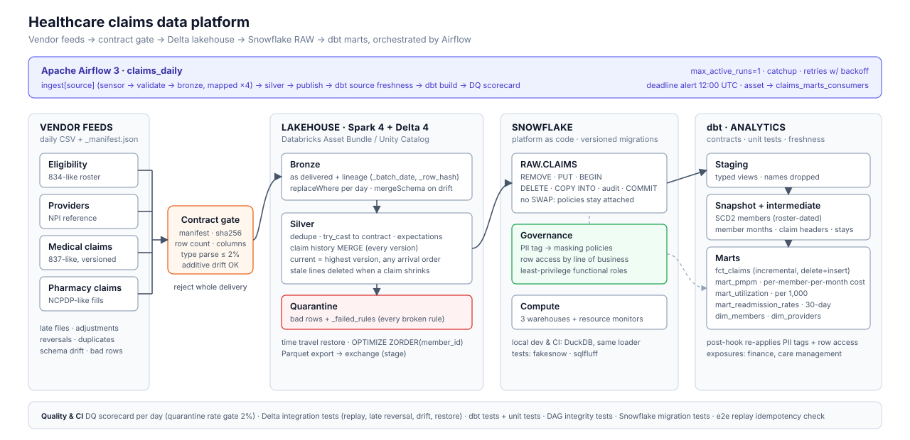

# claims-data-platform

[](https://github.com/yogvidwankhede/claims-data-platform/actions/workflows/ci.yml)

A healthcare-claims data platform that runs **Airflow, a Spark/Delta lakehouse
(Databricks), Snowflake and dbt** together as one pipeline. Payer data breaks in
specific ways: claims that are adjusted and reversed weeks later, files that arrive
late or twice, vendors who change their format, members who switch plans mid-year,
and PHI that must never reach an analyst unmasked. Each of those cases is handled
in code and exercised by tests that run locally and in CI. What could not be run
here (live Snowflake and Databricks) is listed under
[what is not proven here](#production-notes-and-what-is-not-proven-here).



| Layer | Tool | What it does here |
|---|---|---|
| Orchestration | **Airflow 3.3** | `claims_daily` DAG: per-feed mapped task group (sensor → contract check → bronze), silver, publish, dbt, DQ scorecard. Retries with backoff, no retries on rejected files, deadline alert, asset-triggered downstream DAG |
| Lakehouse | **Spark 4 + Delta 4**, deployable as a **Databricks Asset Bundle** | Bronze/silver medallion, MERGE upserts that resolve claim versions regardless of arrival order, quarantine with reasons, schema evolution, time-travel restore, OPTIMIZE/Z-order. Unity Catalog names via one env var |
| Warehouse | **Snowflake** (DuckDB locally and in CI) | Versioned platform-as-code migrations: warehouses per workload with resource monitors, RBAC, tag-based PII masking, line-of-business row access. Transactional reload that keeps policies attached |
| Transformation | **dbt 1.12** | Staging, SCD2 member snapshot, member-months, PMPM, utilization per 1,000, 30-day readmissions. Enforced model contracts, unit tests, source freshness from the load audit, incremental claims fact |

## Run it

```bash
make install                 # platform + Spark/Delta + dbt + dev tools (Java 17+ for Spark)
make e2e                     # 5 days of synthetic vendor feeds through the whole platform
make test                    # unit + Delta integration + Airflow DAG tests
make install-airflow         # Airflow gets its own venv (see ADR 0001)
```

`make e2e` generates the deliveries, then runs each day in date order the way the
DAG does: `claims-platform run-day` (validate → bronze → silver → publish), then
`dbt build` and `claims-platform dq-report`. The warehouse ends up in
`data/warehouse.duckdb`. Every step is a CLI subcommand, so a failing Airflow task
can be reproduced with one command:

```text
claims-platform generate | validate | bronze | silver | publish | run-day
                | dq-report | optimize | restore | migrate
```

## What a 10-day run produced

Measured locally (`scripts/e2e.sh 2026-01-01 10`, 2,000 members, seed 7; the first
delivery also carries a 120-day history backfill), on a 2-vCPU container with
local-mode Spark:

| | |
|---|---|
| Medical claim lines delivered | 6,866 |
| Exact duplicates dropped | 72 |
| Rows quarantined (with reasons) | 29 |
| Deliveries rejected by contract | 0 |
| Schema drift (`rendering_npi` added from day 7) | accepted; older rows null |
| Current claims in `fct_claims` | 3,690 (149 adjusted to version 2, 39 reversed) |
| Member plan/address changes captured as SCD2 versions | 68 |
| DQ scorecard | PASS on all 10 days (max medical quarantine rate 0.43%, day 1) |
| Replaying the last day, then `dbt build` | marts, snapshot and paid totals unchanged |
| Same day again through Airflow (`airflow dags test claims_daily 2026-01-10`) | all 17 task instances succeeded; marts unchanged |
| Time per day, lakehouse steps | ~95 s |

The data is synthetic, generated with realistic failure modes (see
`src/claims_platform/generator.py`). The numbers describe the pipeline's
behavior, not any real population.

## Problems handled in code

**Claim versions arrive in any order.** Silver keeps every version in a history
table and only the highest version in `medical_claims_current`. A reversal that
arrives before the original still wins, and a new version with fewer lines leaves no
stale lines behind (MERGE delete, then a guarded upsert). [ADR 0003](docs/adr/0003-order-independent-claim-versions.md)

**Bad files and bad rows get different responses.** A delivery that fails its YAML
contract (manifest, sha256, row count, required columns, a column retyped) is
rejected whole and not retried. Rows that fail expectations (ICD-10 format, negative
payment, unknown member, ...) go to quarantine with every rule they broke. A
quarantine rate above 2% makes the day's scorecard DEGRADED and raises an alert.
[ADR 0002](docs/adr/0002-contracts-at-the-door-expectations-inside.md)

**Every step is idempotent.** Bronze replaces its day's partition (`replaceWhere`),
silver MERGEs, the warehouse reload is a single transaction, and `fct_claims` is
delete+insert on `claim_id`. CI replays the latest day and checks that row counts
and paid totals in the marts and the snapshot are unchanged.

**PHI stays governed.** Names never leave RAW. Date of birth is tagged `PII` in RAW,
and a dbt post-hook applies the same tag in the snapshot and the marts. The tag's
masking policy generalises it to the birth year for anyone without `PHI_READER`.
Analysts can read only the `MARTS` schema, and every mart, including the claim-level
facts, carries a line-of-business row access policy, so analysts see only the plans
they are entitled to. The loader never uses `SWAP`, which would drop the policies.
A test fails if any contract column marked `pii: true` is left untagged.
[ADR 0004](docs/adr/0004-snowflake-reload-in-place-and-tag-based-masking.md)

**Members change plans.** The dbt snapshot dates each version by the roster
delivery date, not the clock, so reruns rebuild the same history. PMPM and
utilization attribute each month to the plan in force at the time, and a test
reconciles mart dollars to paid claims within 0.5%.
[ADR 0005](docs/adr/0005-scd2-effective-dating-from-the-roster.md)

**Recent months are incomplete.** Claims trickle in for weeks after service.
`mart_pmpm.runout_days` says how settled each month is, and readmission rates only
count stays whose 30-day follow-up window has closed.

## Repository

```text
src/claims_platform/     CLI, generator, contracts, lakehouse (Spark/Delta), warehouse loader, migrations runner, DQ
contracts/               YAML data contracts, one per vendor feed
snowflake/migrations/    V001 compute + monitors · V002 roles/grants · V003 RAW tables · V004 masking + row access
dbt/                     staging → snapshot → intermediate → marts; contracts, unit tests, exposures
airflow/dags/            claims_daily · claims_maintenance · claims_marts_consumers · claims_alerts (callbacks)
databricks.yml           Asset Bundle; jobs in databricks/jobs.yml
docs/                    architecture, ADRs, runbook
```

## Tests

| Suite | Count | Runs |
|---|---|---|
| Transforms on plain Spark (casts, expectations, dedupe, NPI check digit, ICD-10) | 14 | CI `unit` |
| Delivery contracts (checksum, truncation, dropped/retyped column, drift) | 11 | CI `unit` |
| Snowflake: migration runner on fakesnow, DDL ↔ contracts, PII tagging, loader statements, rollback, key handling | 11 | CI `unit` |
| Databricks bundle: every job task is a valid CLI call; paths, permissions, Snowflake config | 10 | CI `unit` |
| DQ scorecard | 3 | CI `unit` |
| Delta integration: replay no-op, late reversal, shrinking claim, drift, quarantine, restore, optimize | 7 | CI `delta` |
| Airflow DAG integrity: order, retries, alerts, deadline, assets | 8 | CI `airflow` |
| dbt: 52 data tests, 3 unit tests, 5 enforced contracts | | CI `lint` (parse) + `e2e` |
| End to end: 3 days, then a replay of the latest day with a diff of the marts | | CI `e2e` |

## Production notes, and what is not proven here

- **Snowflake and Databricks were not deployed.** Everything above ran locally, with
  DuckDB standing in for Snowflake. The Snowflake migration runner and RAW DDL
  execute on fakesnow. Account-level objects (warehouses, roles, policies) get only
  sqlfluff and static tests, and sqlfluff can't parse the resource-monitor and
  `ALTER TAG` statements, so those are excluded. The dbt governance post-hook is a
  no-op on DuckDB, so masking and row access have never executed. Tags, masking
  and row access policies, and multi-cluster warehouses, require Snowflake
  Enterprise edition. The Databricks bundle is checked
  structurally (every task maps to a real CLI invocation), not with `databricks
  bundle deploy`. dbt contracts are verified on DuckDB. Their data types are
  written to be valid on Snowflake too, but they have not been run there.
- On Airflow 3.3.2, `airflow dags test` runs every task and then raises an error
  while clearing the DAG's deadline alert. The command expects alert IDs that only
  the DAG processor assigns when it serializes the DAG. A full scheduler run was
  not part of this verification.
- In production, Airflow would trigger the Databricks job (`DatabricksRunNowOperator`)
  instead of running Spark on its workers. The CLI calls stay the same (ADR 0001).
- The warehouse reload rewrites each RAW table, which is fine at this volume. At
  larger volume it would become a MERGE keyed on `_batch_date`.

Operations: [runbook](docs/runbook.md) · Decisions: [docs/adr](docs/adr)
